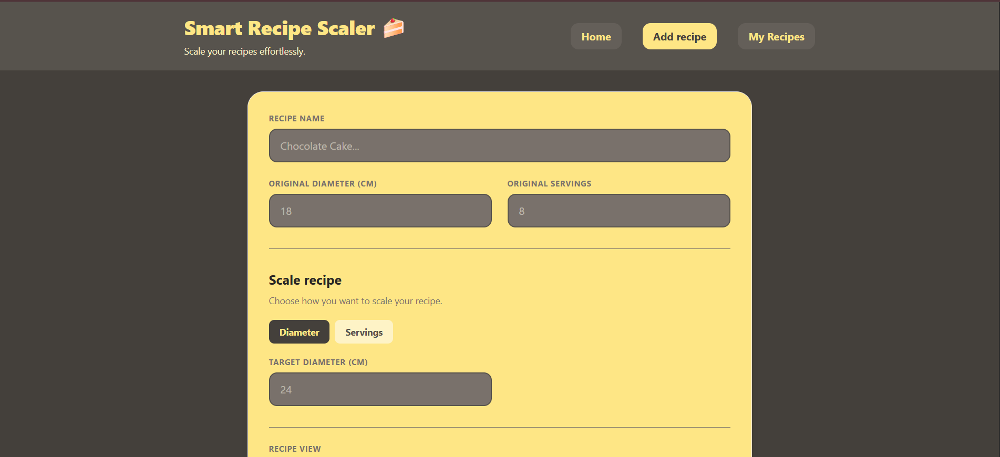
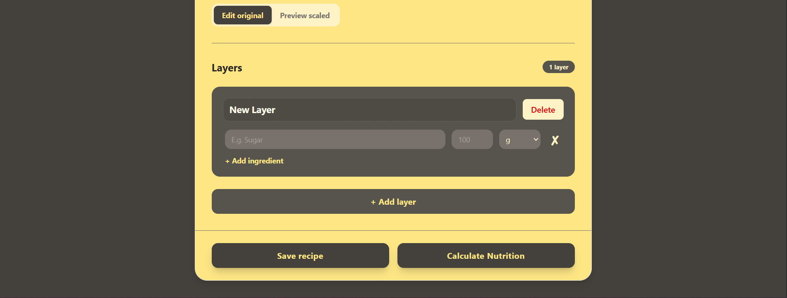
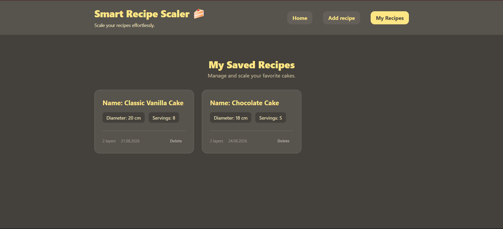
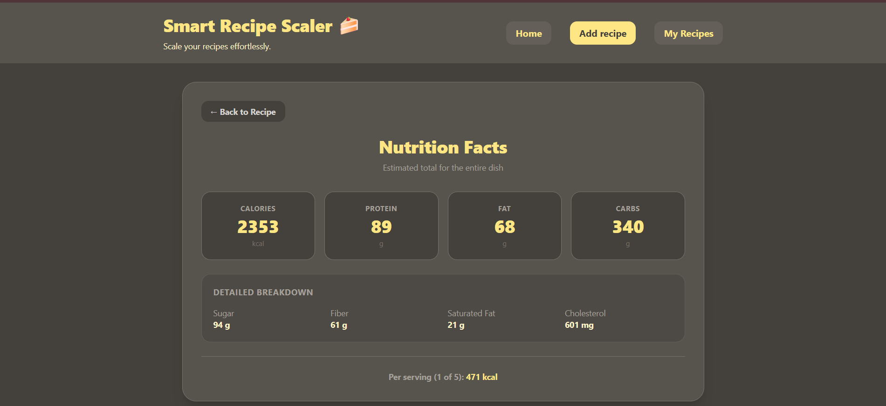

# 🍰 Smart Recipe Scaler

A web application for creating, managing, and automatically scaling cake and dessert recipes.

Smart Recipe Scaler allows users to organize recipes into layers, add ingredients, scale quantities based on cake diameter or number of servings, save recipes locally, and calculate estimated nutrition information.

## Live Demo

URL: https://smart-recipe-scaler.vercel.app 

---

## Features

- Create and edit recipes
- Add and delete recipe layers
- Rename recipe layers
- Add, edit, and remove ingredients
- Scale ingredient quantities by cake diameter
- Scale recipes by the number of servings
- Switch between the original and scaled recipe view
- Calculate the scaling factor automatically
- Save recipes locally
- Open and edit saved recipes
- Update existing recipes
- Delete saved recipes
- Calculate estimated nutrition information
- Display calories and macronutrients for the entire recipe
- Display calories per serving
- Handle loading and error states during nutrition calculations
- Validate required recipe fields
- Responsive design for desktop and mobile devices

---

## Recipe Scaling

### Scale by diameter

When scaling a cake by diameter, the application calculates the scaling factor based on the area of the cake.

```text
scaleFactor = targetDiameter² / originalDiameter²
```

For example:

```text
Original diameter: 18 cm
Target diameter: 24 cm

scaleFactor = 24² / 18²
```

Each ingredient quantity is multiplied by the calculated scaling factor.

---

### Scale by servings

When scaling by servings:

```text
scaleFactor = targetServings / originalServings
```

For example:

```text
Original servings: 8
Target servings: 12

scaleFactor = 12 / 8 = 1.5
```

Each ingredient quantity is multiplied by the scaling factor.

---

## Nutrition Calculation

The application can calculate estimated nutrition information based on the ingredients in a recipe.

The nutrition view displays:

- Calories
- Protein
- Fat
- Carbohydrates
- Sugar
- Fiber
- Saturated fat
- Cholesterol

The application also calculates calories per serving when the number of servings is provided.

---

## Recipe Management

Recipes can be saved and managed directly in the application.

Users can:

- Save a new recipe
- View saved recipes
- Open an existing recipe
- Edit a recipe
- Update an existing recipe
- Delete a recipe

Saved recipes are persisted in the browser using `localStorage`.

---

## Tech Stack

- React
- TypeScript
- Vite
- Tailwind CSS
- Zustand
- Zustand Persist
- React Router
- Vitest
- REST API
- localStorage
- Vercel

---

## Testing

The project includes tests for the recipe scaling logic using Vitest.

The scaling functionality is tested for:

- Scaling recipes by diameter
- Scaling recipes by servings
- Different scaling factors

Run the tests with:

```bash
npm run test
```

---

## Responsive Design

The interface is designed to work across different screen sizes:

- Desktop
- Tablet
- Mobile

Tailwind CSS is used for responsive layouts and styling.

---

## Screenshots

### Recipe Builder




### Saved Recipes



### Nutrition Calculator



---

## Installation

Clone the repository:

```bash
git clone https://github.com/SofiaUmrish/smart-recipe-scaler.git
```

Navigate to the project folder:

```bash
cd smart-recipe-scaler
```

Install dependencies:

```bash
npm install
```

Start the development server:

```bash
npm run dev
```

Open the application in your browser.

---


## Author

Created by **Sofia Umrish**
